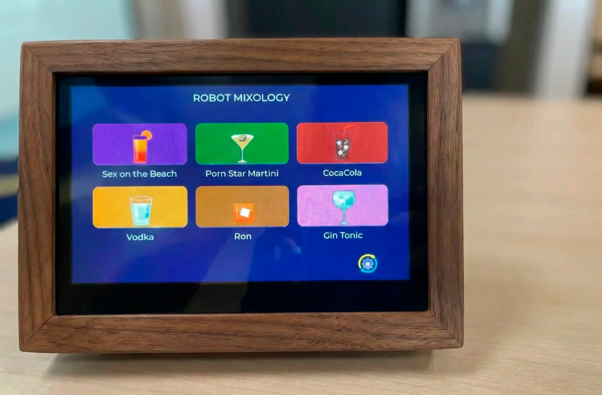
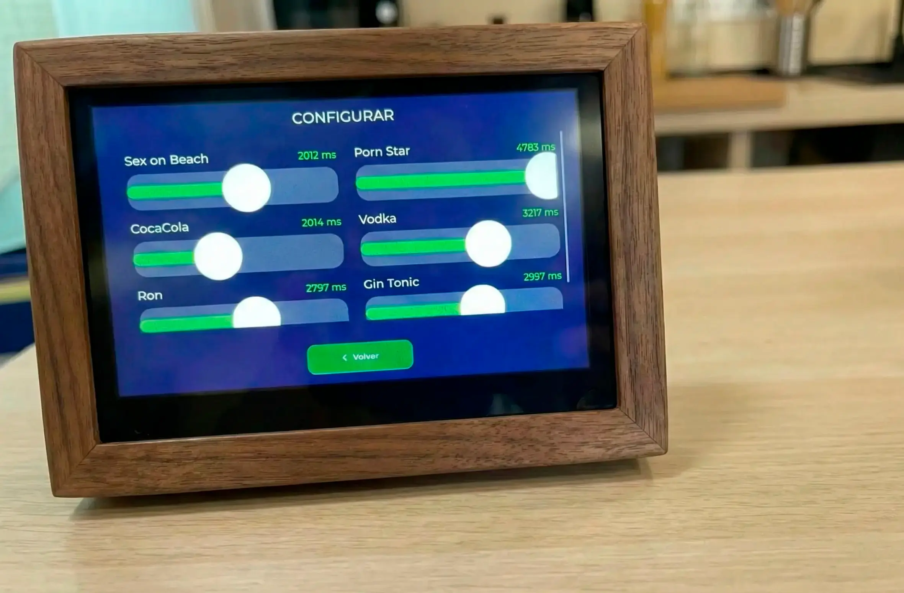

# 🤖 Robot-Core Mixology S3 🍹


## Para Pantallas Baratas ESP32-S3 (AliExpress)

🇺🇸 **[Read in English](README.md)** | 🇪🇸 **[Leer en Español](README_ES.md)**


Este proyecto proporciona una implementación base para las **pantallas inteligentes genéricas de 4.3 pulgadas** (ESP32-S3 IPS 800x480) que se encuentran fácilmente en **AliExpress** (modelos tipo Sunton 8048S043 o clones).
 El proyecto está optimizado para ser cargado tanto desde el IDE de Arduino como desde VS Code con PlatformIO.

## ✨ Características
- **Pantalla**: IPS de 4.3 pulgadas, resolución 800x480.
- **Controlador**: ESP32-S3.
- **Framework**: Arduino.
- **Interfaz Gráfica**: [LVGL v9.1.0](https://lvgl.io/).
- **Librería de Gráficos**: [Arduino_GFX](https://github.com/moononournation/Arduino_GFX).
- **Estabilización Anti-Flicker**: Estrategia de **"Aislamiento de Bus"** (SRAM + Bounce Buffer) para eliminar parpadeos por concurrencia en PSRAM.
- **UI Modular**: Interfaz basada en componentes (Pages/Components) con LVGL 9.1 que consta de **3 Pantallas Principales**:
    1.  **Selección de Bebidas**: Galería visual para ver y elegir cócteles.
    2.  **Configuración de Recetas**: Modal interactivo para ajustar ingredientes y cantidades de cada cóctel.
    3.  **Configuración de Bombas**: Ajuste de calibración y tiempos de las 4 bombas peristálticas.

[](https://github.com/Albert-Benavent-Cabrera/Robot-Core)
- **Configuración Remota**: La pantalla recibe cócteles e ingredientes vía ESP-NOW desde la App Drinks (Robot Core). Al modificar valores en los sliders, la configuración se guarda en el servidor de forma remota, no localmente. Muestra datos "Mock" si no hay conexión estable.
- **Comunicación ESP-NOW**: Comunicación inalámbrica directa con la Máquina de Bebidas. Envía selecciones de bebidas por broadcast.
- **Sincronización Inteligente de Canal**: Escanea automáticamente la red WiFi objetivo para sintonizar su canal de radio con el receptor.

<p align="center">
  
  
</p>

## 🛠️ Guía de Inicio con Arduino IDE

Este proyecto es totalmente compatible con el IDE de Arduino. Sigue estos pasos para configurarlo:

### 1. 📚 Preparación de Librerías

Instala estas **2 librerías** desde el **Gestor de Librerías** de Arduino (**Herramientas > Gestionar librerías**):

1. **lvgl** (v9.1.0) - Motor de gráficos.
2. **GT911** - Driver del panel táctil.

Para **Arduino_GFX**, tienes dos opciones:
*   **Copiarla**: Copia la carpeta `lib/GFX_Library_for_Arduino` de este proyecto a tu carpeta de librerías de Arduino (`Documents/Arduino/libraries/`).
*   **Descargarla**: Instala **"GFX Library for Arduino"** indicando la versión **1.6.4** desde el Gestor.

> [!IMPORTANT]
> Si recibes errores tipo `No such file or directory` con cualquiera de estos nombres, es porque falta la librería correspondiente en el gestor de Arduino.

### 2. ⚙️ Configuración Crítica de LVGL
Para que la interfaz funcione y LVGL sepa cómo manejar esta pantalla, debes copiar el archivo `lv_conf.h` que se encuentra en la carpeta `display/` de este proyecto a la carpeta de librerías de Arduino, **fuera** de la carpeta `lvgl`.

- **En macOS**: `/Users/tu_usuario/Documents/Arduino/libraries/lv_conf.h`
- **En Windows**: `C:\Users\tu_usuario\Documents\Arduino\libraries\lv_conf.h`

> [!CAUTION]
> **No** pongas el archivo dentro de la carpeta `lvgl`. Debe quedar en la carpeta `libraries` al mismo nivel que la carpeta `lvgl`. Esto soluciona el error `fatal error: ../../lv_conf.h: No such file or directory`.

### 3. 🔌 Instalación y Selección de la Tarjeta
Si no tienes las tarjetas ESP32 instaladas en tu IDE de Arduino:
1. Ve a **Archivo > Preferencias**.
2. En **Gestor de URLs Adicionales de Tarjetas**, pega esta URL:
   `https://raw.githubusercontent.com/espressif/arduino-esp32/gh-pages/package_esp32_index.json`
3. Ve a **Herramientas > Placa > Gestor de tarjetas**, busca **esp32** e instala la versión más reciente.

### 4. 🎛️ Ajustes de la Placa
En el menú **Herramientas**, selecciona la placa **ESP32S3 Dev Module** y aplica estos ajustes confirmados:
- **USB CDC On Boot**: Enabled
- **Flash Size**: 16MB (128Mb)
- **Partition Scheme**: 16M Flash (3MB APP/9.9MB FATFS)
- **PSRAM**: "OPI PSRAM"
- **Flash Mode**: **"DIO"** (más estable para la subida que QIO en algunos sistemas)
- **Upload Speed**: **921600** (recomendado) o 115200 (si hay errores). Se puede usar cualquiera disponible.

### 5. 📤 Carga del Proyecto
1. Abre el archivo `display/display.ino`.
2. Haz clic en **Subir**. (Con el modo **DIO** configurado, la carga debería ser automática sin necesidad de tocar botones).
3. **Nota de ayuda**: Solo si el IDE se queda bloqueado en `Connecting...`, mantén pulsado el botón **BOOT** un segundo para forzar la entrada en modo programación.

## 💻 Uso Alternativo con PlatformIO

Si prefieres usar PlatformIO, el proyecto está listo para funcionar:
1. Abre la carpeta raíz en VS Code.
2. PlatformIO descargará automáticamente las dependencias basándose en el archivo `platformio.ini`.
3. Compila y sube directamente desde la barra inferior.

## 🎨 Diseño de la Interfaz

### 3. Personalización de la UI
Ahora la interfaz de usuario se gestiona manualmente en C++ (LVGL nativo). **Usamos biblioteca propia de componentes** para garantizar limpieza y compatibilidad.

La estructura de la UI se encuentra en `src/ui/`:
*   `ui.cpp / .h`: Punto de entrada y definición de pantallas.
*   `assets/`: Iconos y recursos (actualmente `icons.h` con símbolos vectoriales).
*   `components/`: Elementos reutilizables:
    *   `MyButton`: Botones con soporte de iconos y personalización.
    *   `MySlider`: Deslizadores (sliders).
    *   `MyCard`: Tarjetas interactivas (Imagen superior + Texto inferior).
    *   `MyIcon`: Wrapper para iconos.

Para añadir nuevos elementos, edita directamente `create_screen1()` o `create_screen2()` en `ui.cpp` utilizando estos componentes.


## 🛡️ Estabilización de Pantalla (Solución al Parpadeo)

Este proyecto implementa una arquitectura de **Aislamiento de Bus** diseñada específicamente para el ESP32-S3 con paneles RGB de alta resolución (800x480). Esta configuración elimina el parpadeo (flickering) que ocurre cuando el WiFi u otras tareas compiten por el acceso a la PSRAM.

### Ventajas del Super Buffer / Aislamiento de Bus:
- **Buffers LVGL en SRAM**: Los buffers de dibujo de LVGL se alojan en la **RAM Interna (SRAM)**. Esto permite redibujar la interfaz a máxima velocidad sin depender del bus de la PSRAM.
- **Bounce Buffer**: Se utiliza un buffer intermedio de 40 líneas en SRAM que actúa como "escudo" para el hardware del LCD, asegurando una señal constante incluso durante procesos intensos de red (WiFi/OTA).
- **Golden Timings (8/4/43)**: Sincronismos optimizados para las revisiones de hardware Sunton, garantizando que el panel no pierda el enganche de señal.


## 📡 Comunicación Remota (ESP-NOW)

La pantalla se comunica con la **Máquina de Bebidas** (o cualquier receptor ESP-NOW compatible) para enviar comandos de selección.

### 1. 🔑 Configuración
Como ESP-NOW requiere que ambos dispositivos estén en el mismo canal WiFi, la pantalla busca una red existente para sincronizarse.
1. Crea un archivo `src/core/secrets.h` (o renombra `secrets_example.h`).
2. Define el nombre (SSID) de la red a la que está conectado tu receptor:
   ```cpp
   #define TARGET_WIFI_SSID "Tu_Red_WiFi"
   ```

### 2. 📊 Protocolo
La comunicación utiliza una estructura compartida definida en `src/core/remote_protocol.h`. Si modificas el protocolo, asegúrate de mantener la compatibilidad binaria tanto en el emisor (Pantalla) como en el receptor.


## 🛠️ Scripts y Herramientas

En la carpeta `scripts/` encontrarás herramientas Python para facilitar el desarrollo y la gestión de assets gráficos:

### 1. `update_project_assets.py` (Específico del Proyecto)
Actualiza automáticamente todos los assets del proyecto (`src/ui/assets/*.c`) basándose en los PNGs originales ubicados en `src/ui/assets/drinks/` y `config.png`.
- **Uso**: Ejecutar desde la raíz del proyecto: `python3 scripts/update_project_assets.py`
- **Función**: Convierte los PNGs a arrays **ARGB8888** (Mapas de bits de 32 bits) optimizados para renderizado instantáneo, eliminando el lag de decodificación en tiempo real.

### 2. `png2lvgl.py` (Genérico)
Herramienta de propósito general para convertir *cualquier* imagen PNG a un archivo fuente C compatible con LVGL v9.
- **Uso**: `python3 scripts/png2lvgl.py <imagen.png> [-o salida.c] [-n nombre_variable]`
- **Ejemplo**: `python3 scripts/png2lvgl.py logo.png` generará `logo.c` listo para incluir en tu proyecto con la estructura `lv_img_dsc_t`.

---
*Este proyecto busca simplificar el uso de estas pantallas Sunton en el entorno Arduino, centralizando la configuración necesaria para el hardware ESP32-S3.*
